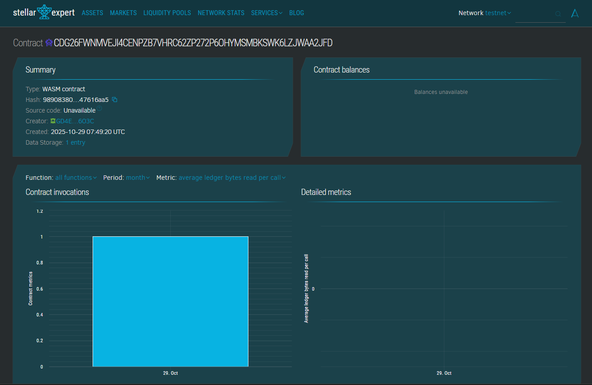

# Property Registry

A blockchain-based land and property ownership registry system built on Stellar's Soroban smart contract platform.

## Table of Contents

- [Project Title](#project-title)
- [Project Description](#project-description)
- [Project Vision](#project-vision)
- [Key Features](#key-features)
- [Future Scope](#future-scope)

---

## Project Title

**Property Registry**

---

## Project Description

Property Registry is a decentralized land and property ownership management system built on the Stellar blockchain using Soroban smart contracts. This system enables transparent, immutable, and secure registration of property ownership records on the blockchain, eliminating traditional paperwork, reducing fraud, and streamlining property transfer processes.

The smart contract provides core functionalities for registering new properties, transferring ownership between parties, viewing property details, and tracking the total number of registered properties on the platform. Each property is assigned a unique identifier and stored permanently on the blockchain with complete ownership history.

---

## Project Vision

Our vision is to revolutionize property and land registry systems by leveraging blockchain technology to create a transparent, fraud-resistant, and efficient platform for property ownership management. We aim to:

- **Eliminate fraud** in property transactions through immutable blockchain records
- **Reduce bureaucracy** by automating property registration and transfer processes
- **Increase transparency** by providing verifiable ownership records accessible to authorized parties
- **Lower transaction costs** by removing intermediaries from property transfers
- **Enable global access** to property records through decentralized infrastructure
- **Build trust** among stakeholders through cryptographic verification and smart contract automation

By implementing this blockchain-based registry, we strive to modernize outdated land administration systems and provide secure, reliable property ownership records for individuals, businesses, and governments worldwide.

---

## Key Features

### 1. Property Registration
- Register new properties with unique identifiers on the blockchain
- Store essential property details including owner address, location, area, and registration timestamp
- Immutable records ensure data integrity and prevent unauthorized modifications

### 2. Ownership Transfer
- Secure transfer of property ownership between parties
- Cryptographic authentication ensures only legitimate owners can initiate transfers
- Automated execution through smart contracts eliminates manual intervention

### 3. Property Verification
- View detailed property information using property ID
- Verify ownership and property details transparently
- Access complete property history stored on the blockchain

### 4. Decentralized Storage
- All property records stored on Stellar blockchain
- No single point of failure or centralized authority
- Permanent and tamper-proof record keeping

### 5. Authentication & Security
- Owner authentication required for all transfer operations
- Address-based verification prevents unauthorized access
- Smart contract logic ensures rule enforcement

---

## Future Scope

### Enhanced Functionality
- **Multi-signature approvals** for property transfers involving multiple stakeholders
- **Property valuation integration** with real-time market data
- **Mortgage and lien tracking** to record encumbrances on properties
- **Rental agreement management** for lease tracking and rental income distribution
- **Property subdivision and merger** capabilities for land development projects

### Technical Improvements
- **IPFS integration** for storing property documents (deeds, surveys, photos)
- **Oracle integration** for connecting with government land records and legal databases
- **Cross-chain compatibility** to interact with other blockchain networks
- **Mobile application** for easy property registration and transfer on-the-go
- **Web3 frontend** with user-friendly interface for non-technical users

### Regulatory & Compliance
- **Government integration** for official recognition of blockchain records
- **Legal framework compliance** to meet local property law requirements
- **Tax calculation automation** for property transfer taxes and stamp duties
- **Dispute resolution mechanisms** integrated with smart contract arbitration
- **KYC/AML compliance** for regulatory adherence in property transactions

### Advanced Features
- **Fractional ownership** support for tokenizing property shares
- **Automated property auctions** through smart contract bidding systems
- **Property insurance integration** for automated claims and coverage verification
- **Real estate marketplace** connecting buyers and sellers directly
- **Analytics dashboard** for property market insights and trends

### Scalability & Interoperability
- **Layer-2 scaling solutions** for handling increased transaction volumes
- **Multi-network deployment** across different blockchain platforms
- **API development** for third-party integration with real estate platforms
- **Standardization** of property data formats for global compatibility

---

## Technical Stack

- **Blockchain Platform**: Stellar Network
- **Smart Contract Platform**: Soroban
- **Programming Language**: Rust
- **SDK**: Soroban Rust SDK
- **Storage**: On-chain storage with TTL management

## Getting Started

### Prerequisites
- Rust toolchain installed
- Soroban CLI tools
- Stellar account for deployment

### Installation
```bash
# Install Soroban CLI
cargo install --locked soroban-cli

# Build the contract
soroban contract build
```

Deploy to network
```bash
soroban contract deploy
    --wasm target/wasm32-unknown-unknown/release/property_registry.wasm
    --source <YOUR_SECRET_KEY>
    --network testnet
```


### Usage Examples

**Register a Property:**
```bash
soroban contract invoke
    --id <CONTRACT_ID>
    --source <OWNER_SECRET_KEY>
    --network testnet
    -- register_property
    --owner <OWNER_ADDRESS>
    --location "123 Main St, City, Country"
    --area 1000
```


**Transfer Property:**
```bash
soroban contract invoke
--id <CONTRACT_ID>
--source <CURRENT_OWNER_SECRET_KEY>
--network testnet
-- transfer_property
--property_id 1
--new_owner <NEW_OWNER_ADDRESS>
```


**View Property:**
```bash
soroban contract invoke
--id <CONTRACT_ID>
--network testnet
-- view_property
--property_id 1
```

---

## License

This project is open-source and available under the MIT License.

## Contributing

Contributions are welcome! Please feel free to submit pull requests or open issues for bugs and feature requests.

## Contact

For questions or support, please open an issue in the repository.

---

## Contract Details
##### CDG26FWNMVEJI4CENPZB7VHRC62ZP272P6OHYMSMBKSWK6LZJWAA2JFD




**Built with ❤️ on Stellar Soroban**


